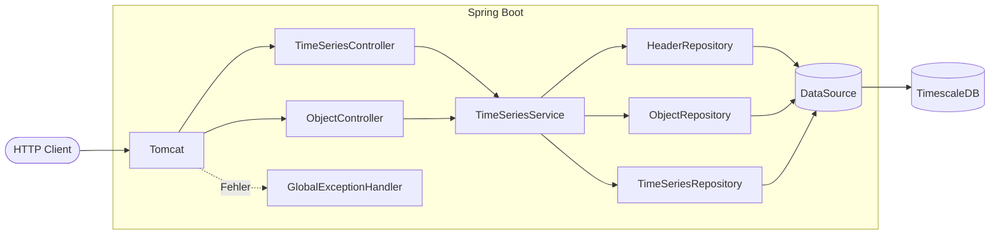
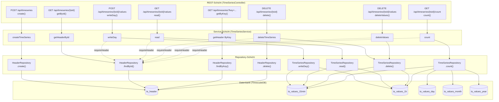
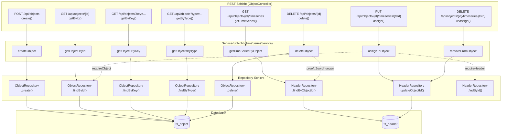
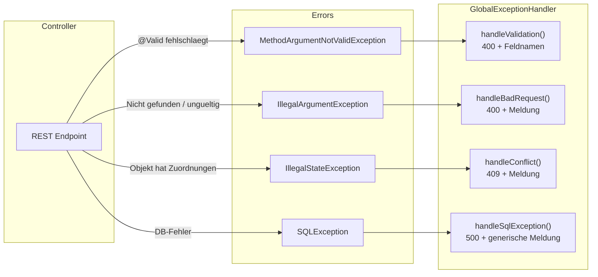
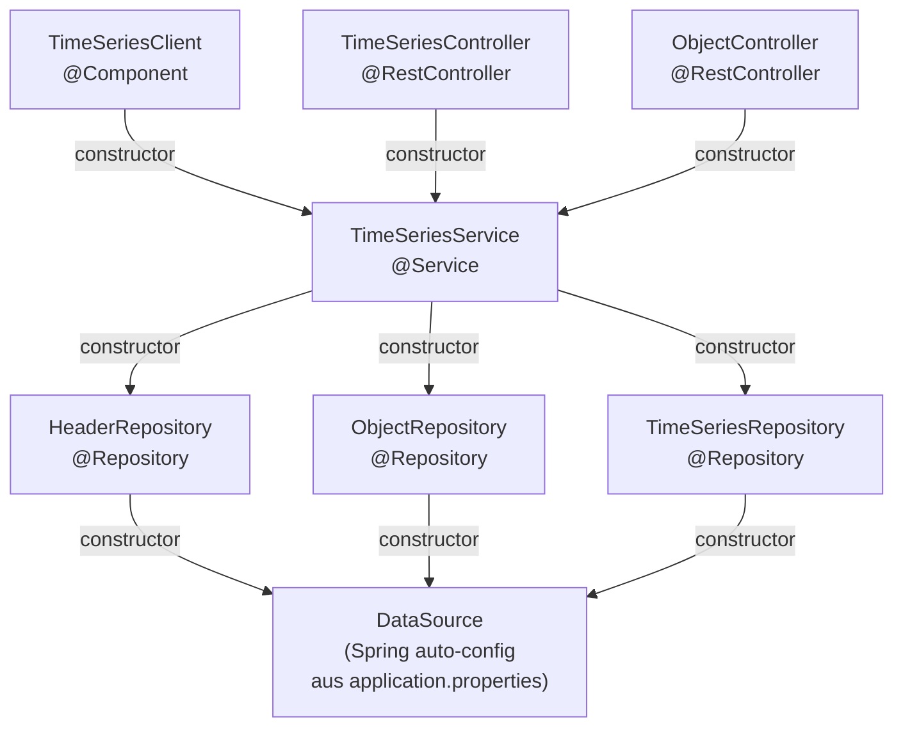

# Architektur-Diagramm: Request-Flow

## Schichten-Uebersicht

## Detaillierter Request-Flow: Zeitreihen

## Detaillierter Request-Flow: Objekte

## Exception-Flow

## Bean-Wiring (Dependency Injection)

